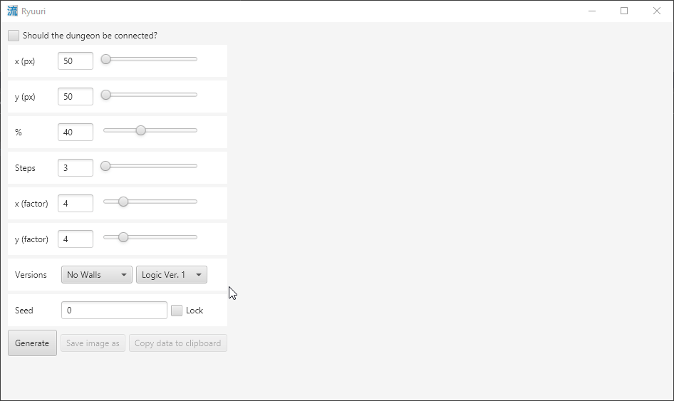

# Ryuuri (tiralab - Helsinki 2021)

 
[](https://codecov.io/gh/Luukuton/Ryuuri-tiralab2021)

The name, Ryuuri (流離), is Japanese and means _"to wander in a foreign country far from home"_.



### Examples of some dungeons

1. 200x200 px, 41 %, 10 steps, x & y scaled by 2, seed: 2352837519905149105, no walls, logic V1
2. 400x400 px, 40 %, 5 steps x & y not scaled, seed: 8701462806124051100, no walls, logic V1, connected
3. 200x200 px, 40 %, 5 steps, x & y scaled by 2, seed: 1365928333090366521, no walls, logic V2, connected
4. 400x400 px, 45 %, 5 steps x & y not scaled, seed: -706147279899605297, no walls, logic V2, connected


## Weekly reports

[Week 6](documentation/weekly_reports/week6.md)

[Week 5](documentation/weekly_reports/week5.md)

[Week 4](documentation/weekly_reports/week4.md)

[Week 3](documentation/weekly_reports/week3.md)

[Week 2](documentation/weekly_reports/week2.md)

[Week 1](documentation/weekly_reports/week1.md)

## Documentation

[User Guide](documentation/user_guide.md)

[Specifications](documentation/specifications.md)

[Implementation](documentation/implementation.md)

[Testing](documentation/testing.md)

## Running

The application can be run with:
```
gradlew run
```

## Building a JAR
For Linux & Windows on Windows:
```
gradlew shadowJar -Dplatform=linux.x86_64
```

## Testing

Tests can be performed with: 
```
gradlew test
```

and benchmarks with: 
```
gradlew clean benchmark
```
or:
```
gradlew clean benchmark -Dtest.type=bit
```
for BitSet[] benchmarks.

Code coverage can be created with:
```
gradlew test jacocoTestReport
```

Code coverage can be viewed by opening _build/reports/jacoco/test/html/index.html_ in a browser.

## JavaDoc

JavaDoc files can be created with:
```
gradlew javadoc
```

They can be viewed by opening _build/docs/javadoc/index.html_ in a browser.

## CheckStyle

Checks defined in [checkstyle.xml](config/checkstyle/checkstyle.xml) can be executed with:
```
gradlew checkstyleMain
```

Results can be viewed by opening _target/site/checkstyle.html_ in a browser.

## Dependencies
* Java 11+
* Gradle 6.8.1+
