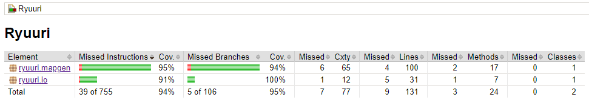
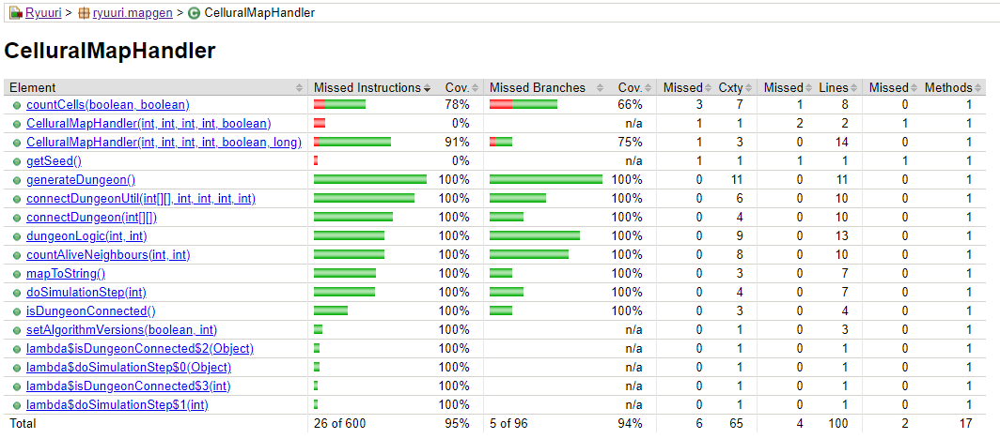
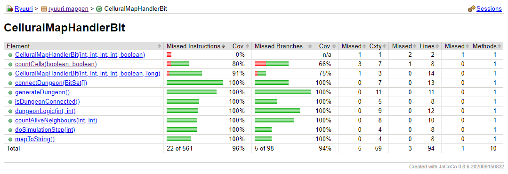
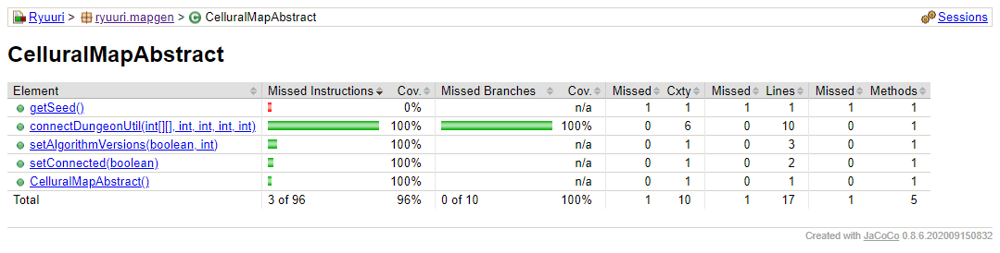
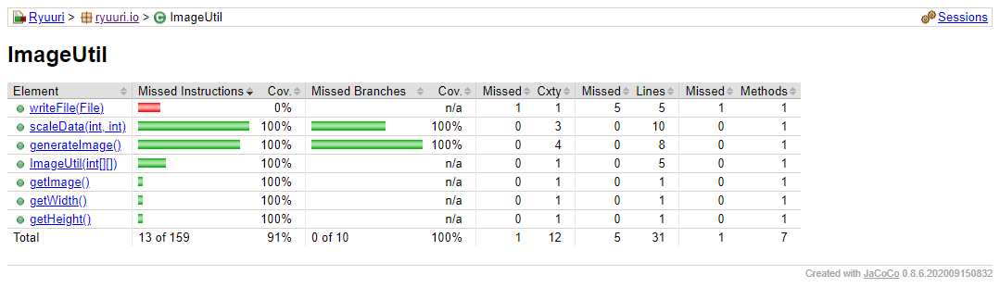
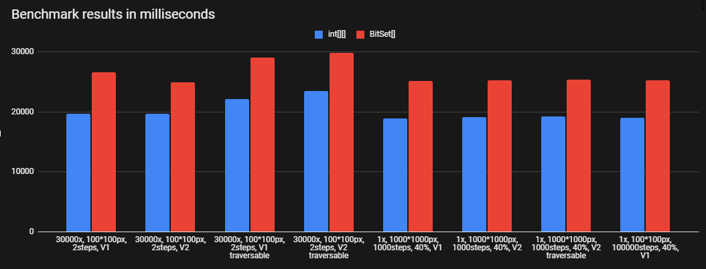

# Testing

All testing is done with JUnit 5 using its tags (@Tag) and parameters (@ParameterizedTest) 
to differentiate unit tests and benchmarks from each other.

## Unit tests

Performed with:
```
gradlew test
```
Unit tests are basically instantaneous and make sure that the algorithm and image utility both are working correctly. 
The JavaFX GUI and the Main class have been excluded.

The tests are made mainly with the help of pre-generated data and seeds for the random number generator. 
ImageUtil class is tested with two images found in the test resources.

### Individual tests for the algorithm

- Every test is executed twice: for the int[][] implementation and the BitSet[] implementation of the algorithm. This has been achieved with JUnit's ParameterizedTest.

- **correctStringOutputBasic** tests for basic functionality of the algorithm

- **correctStringOutputOnThreeSimulationSteps** tests with _3 steps_

- **correctStringOutputOnThreeSimulationStepsForLogicV2** tests with 3 steps and _logic version set to 2_

- **correctStringOutputOnThreeSimulationStepsWalls** tests with 3 steps and _outer walls enabled_

- **correctAmountOfAliveNeighbours** tests for 2 different coordinates ({0,0}, {10,10}) for a correct amount of alive neighbours

- **correctStringOutputOn10000SimulationSteps**  tests with _10 000 steps_

- **dungeonIsConnected** tests that the dungeon _is connected_ with a seed that is guaranteed to be connected

- **dungeonIsModifiedToBeConnectedCorrectly** tests that the algorithm is able to create a connected dungeon

- **dungeonIsNotConnected** tests that the dungeon _isn't connected_

### Individual tests for ImageUtil

- **imageGeneratedCorrectly** makes sure that the image is generated correctly by comparing it to a pre-generated png file

- **imageScaledCorrectly** makes sure that the image is scaled correctly by comparing it to a pre-generated png file

- **getImage** tests for the image getter

## Test coverage

### CodeCov

[](https://codecov.io/gh/Luukuton/Ryuuri-tiralab2021)

### JaCoCo

Performed with:
```
gradlew test jacocoTestReport
```

Report can be viewed by opening _build/reports/jacoco/test/html/index.html_ in a browser after the command.











## Benchmarking

In contrast with unit testing, benchmarking can take up a lot of time.
Currently, on system with __Ryzen 1700X @ 3.8GHz and 16GB DDR4 @ 3200MHz CL14__:



int[][] algorithm benchmarked with `gradlew clean benchmark`:

```
Benchmark STANDARD_OUT
    Benchmark results (int[][]):
    19696ms | 30000 random 100 * 100 px, 2 steps, V1 dungeons
    19656ms | 30000 random 100 * 100 px, 2 steps, V2 dungeons
    22095ms | 30000 random 100 * 100 px, 2 steps, V1 traversable dungeons
    23469ms | 30000 random 100 * 100 px, 2 steps, V2 traversable dungeons
    18924ms | 1000 * 1000 px, 1000 steps, 40%, V1,
    19176ms | 1000 * 1000 px, 1000 steps, 40%, V2,
    19186ms | 1000 * 1000 px, 1000 steps, 40%, V2, traversable
    18984ms | 100 * 100 px, 100000 steps, 40%, V1,
```

BitSet[] algorithm benchmarked with `gradlew clean benchmark -Dtest.type=bit`:
```
Benchmark STANDARD_OUT
    Benchmark results (BitSet[][]):
    26675ms | 30000 random 100 * 100 px, 2 steps, V1 dungeons
    24950ms | 30000 random 100 * 100 px, 2 steps, V2 dungeons
    29074ms | 30000 random 100 * 100 px, 2 steps, V1 traversable dungeons
    29879ms | 30000 random 100 * 100 px, 2 steps, V2 traversable dungeons
    25136ms | 1000 * 1000 px, 1000 steps, 40%, V1,
    25330ms | 1000 * 1000 px, 1000 steps, 40%, V2,
    25384ms | 1000 * 1000 px, 1000 steps, 40%, V2, traversable
    25306ms | 100 * 100 px, 100000 steps, 40%, V1,
```

### Individual benchmarks

- **singleDungeon** benchmarks the generation of one dungeon

- **multipleDungeons** benchmarks the generation of multiple dungeons in a row

- Benchmark data is provided by Stream<Arguments> to the methods. 
  There are pre-generated benchmark data in the `src/test/resources` directory 
  testing that the dungeons are correctly generated after every singleDungeon benchmark.
